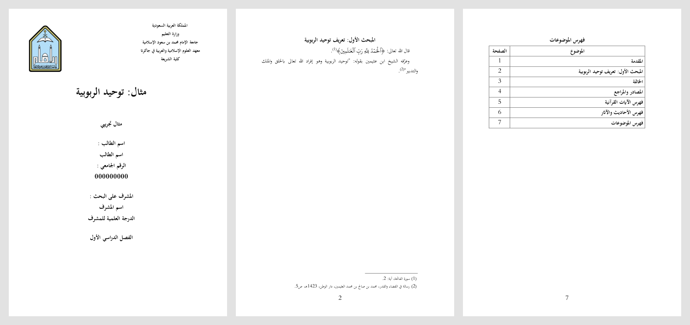
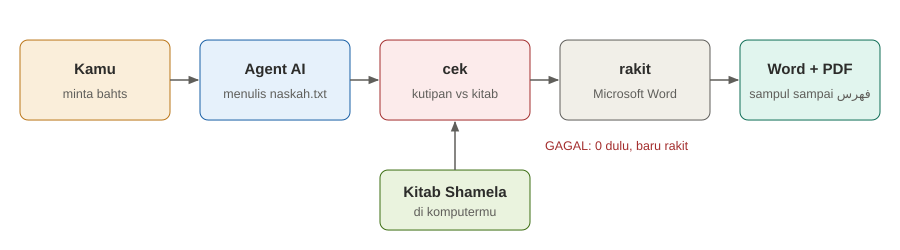

# Mesin Bahts

[](https://github.com/Farisarditiyanto/mesin-bahts/actions/workflows/tes.yml)
[](https://github.com/Farisarditiyanto/mesin-bahts/releases)
[](LICENSE)

Alat bantu menulis **بحث** (makalah ilmiah syar'i berbahasa Arab) bersama agent AI seperti Claude Code.
Kamu cukup meminta. Agent menulis satu berkas, `naskah.txt`. Mesin mengerjakan sisanya:

- mencocokkan tiap kutipan ke teks kitab (المكتبة الشاملة) pada juz dan halaman yang tertulis;
- menulis ayat dengan rasm Utsmani;
- merakit Word dan PDF: sampul, catatan kaki, المصادر والمراجع, فهرس الآيات, فهرس الأحاديث والآثار, فهرس الموضوعات.





## Cara tercepat

1. Buka Claude Code.
2. Tempel kalimat ini, ganti judulnya:

   > Pakai https://github.com/Farisarditiyanto/mesin-bahts untuk membuatkan saya bahts tentang الإخلاص وأثره في قبول العمل. Susunannya: مقدمة, satu فصل berisi dua مبحث, خاتمة. Kira-kira 6 halaman.

3. Jawab pertanyaan agent: nama, nomor mahasiswa, jenis tugas, semester, dan pembimbing beserta jabatannya.

Agent yang mengunduh, memasang, menulis, dan merakit. Kamu tidak perlu mengetik perintah.
Hasilnya ada di folder `mesin-bahts` di dalam folder Dokumen-mu.

Catatan untuk agent AI: repo ini diunduh ke folder `mesin-bahts` di dalam folder Dokumen pemakai. Langkah selanjutnya ada di [`AGENTS.md`](AGENTS.md), mulai dari bagian «Pemakai baru».

## Batasnya, baca dulu

- Ini alat bantu, bukan jaminan. `cek` hanya membuktikan bahwa teksnya ada di juz dan halaman itu.
- `cek` tidak bisa menilai: siapa yang berkata, benar tidaknya nama kitab, derajat hadits, dan kutipan tanpa catatan kaki. **Periksa sendiri kutipan utamamu sebelum mengumpulkan.**
- Teks kitab adalah ketikan Shamela. Ketikan bisa salah.
- Bentuk halaman mengikuti pedoman جامعة الإمام محمد بن سعود الإسلامية. Sampulnya sampul معهد العلوم الإسلامية والعربية في جاكرتا. Kampus lain perlu mengganti `mesin/sampul.doc` dan menambah profil di `mesin/format.json`.
- Proyek ini bukan milik dan tidak mewakili kampus mana pun.

## Yang kamu butuhkan

| Untuk | Butuh |
|---|---|
| Semua perintah | Python 3.12 ke atas, internet saat mengunduh kitab |
| Word dan PDF (`rakit`) | Windows dan Microsoft Word versi desktop |
| Menulis bersama agent | Claude Code, atau agent lain yang membaca `AGENTS.md` |

- Tanpa Windows dan Word, mesin berhenti di `cek`: naskah terperiksa, tetapi Word dan PDF tidak terbentuk.
- WSL tidak diperlukan.
- Belum yakin apa yang kurang? Perintah `periksa` di bawah menyebutnya satu per satu, lengkap dengan cara membereskannya.

## Pasang sendiri (tanpa agent)

```bash
git clone https://github.com/Farisarditiyanto/mesin-bahts.git
```

```bash
cd mesin-bahts
```

```bash
python mesin/bahts.py periksa
```

`periksa` tidak mengubah apa pun. Ia menulis `SIAP` atau `BELUM` untuk tiap kebutuhan, dan perintah untuk tiap yang belum. Jalankan perintah itu, lalu ulangi `periksa` sampai semuanya `SIAP`.

## Connector shamela (pilihan, sangat disarankan)

Connector = sambungan dari agent ke layanan luar. Connector `shamela` (shamela.link) membantu agent mencari kitab mana yang membahas suatu masalah, termasuk kitab yang belum kamu unduh.

- Berkas `.mcp.json` di repo ini sudah mendaftarkannya. Saat folder ini dibuka, Claude Code menawarkan untuk menyalakannya.
- Kalau kamu setuju, kamu masuk dengan akun shamela.link milikmu sendiri.
- Layanan itu tidak resmi dan berkuota. Proyek ini tidak mengelolanya.
- Kalau kamu menolak, mesin tetap jalan: agent mencari lewat `temukan` (isi semua kitab, lewat turath.io, tanpa akun), `katalog`, dan `cari`.
- `.mcp.json` juga mendaftarkan connector pilihan lain. Semuanya layanan orang lain, bukan milik proyek ini:

| Connector | Gunanya | Masuk |
|---|---|---|
| `turath` | mencari di isi semua kitab | tanpa akun |
| `hadithunlocked` | hadits, derajatnya, dan syarahnya | tanpa akun |
| `tafsir` | tafsir per ayat | tanpa akun |
| `quran` | teks ayat | tanpa akun |

## Kunci OpenAlex (pilihan)

`dirasat` mencari penelitian terdahulu. Tanpa kunci, jatahnya kecil. Kunci gratis menaikkan jatah itu dan membuka `dirasat-pdf` (mengunduh PDF penelitian).

1. Daftar di https://openalex.org.
2. Salin kunci dari Settings > API key.
3. Simpan sebagai satu baris di berkas `kunci_openalex.txt` di folder ini, atau berikan ke agent.

## Pakai

1. Buka folder ini di Claude Code.
2. Tulis permintaanmu, seperti contoh di «Cara tercepat».
3. Agent menanyakan data sampul. Nama, nomor mahasiswa, jenis tugas, dan semester disimpan di `sampul_saya.txt` supaya tidak ditanya lagi. Pembimbing ditanya tiap bahts.
4. Agent menyusun خطة, mengunduh kitab, menulis `naskah.txt`, menjalankan `cek`, lalu `rakit`.
5. Hasilnya ada di folder bahts itu: `.pdf` untuk dibaca dan dikumpulkan, `.docx` untuk dibuka di Word.

Alur kerja lengkap dan aturan penulisan untuk agent: [`AGENTS.md`](AGENTS.md).

Tanpa agent juga bisa. Daftar perintah:

```bash
python mesin/bahts.py
```

Daftar tanda untuk `naskah.txt`:

```bash
python mesin/bahts.py tanda
```

Contoh naskah: [`contoh/naskah.txt`](contoh/naskah.txt). Untuk mencobanya: `python mesin/bahts.py ambil 11223`, lalu `python mesin/bahts.py cek contoh`.

## Yang tidak ikut repo

- Naskah, Word, dan PDF-mu. Folder bahts hanya ada di komputermu.
- `sampul_saya.txt`, data sampulmu.
- `kitab/`, kitab yang kamu unduh.
- Font mushaf. `siapkan` mengunduhnya.

## Lisensi

Kode dan dokumentasi: MIT, lihat [`LICENSE`](LICENSE).
Teks mushaf, font mushaf, logo kampus, dan teks kitab bukan bagian dari lisensi itu: lihat [`NOTICE`](NOTICE).

## Melapor dan menyumbang

Masalah atau usul: buka issue di GitHub. Sertakan keluaran `python mesin/bahts.py periksa`, perintah yang kamu jalankan, dan pesan yang keluar.
Perubahan kode: kirim pull request. Tes otomatis (`.github/workflows/tes.yml`) harus hijau.
Riwayat perubahan: [`CHANGELOG.md`](CHANGELOG.md).
